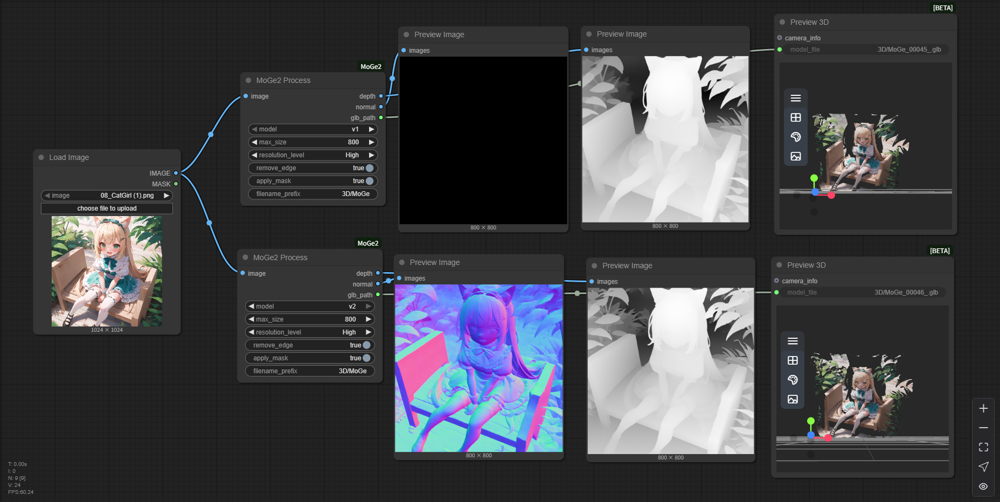

# Comfyui-MoGe2

[ComfyUI](https://github.com/comfyanonymous/ComfyUI) nodes to use [MoGe2](https://github.com/microsoft/MoGe) prediction.

Original repo: https://github.com/microsoft/MoGe

Huggingface demo: https://huggingface.co/spaces/Ruicheng/MoGe-2

## Updates

- [2025-07-29]  Support `Ruicheng/moge-2-vitl-normal` and `Ruicheng/moge-vitl` model.

## Features

|version|model|3D|depth_map|normal_map|
|---|---|---|---|---|
|v1|[Ruicheng/moge-vitl](https://huggingface.co/Ruicheng/moge-vitl/tree/main)|✅|✅|❌|
|v2|[Ruicheng/moge-2-vitl-normal](https://huggingface.co/Ruicheng/moge-2-vitl-normal/tree/main)|✅|✅|✅|

> Using `v1` model to export `normal` will return black image instead of normal map. `Ruicheng/moge-vitl` does not support normal map.

## How to Use

### ComfyUI-Manager

Run ComfyUI → `Manager` → `Custom Nodes Manager` → search and install `Comfyui-MoGe2`

### Git Clone

1. Clone this repo to `ComfyUI/custom_nodes` 
2. Install requirements: `pip install -r requirements.txt`

## Model Support

- [x] [Ruicheng/moge-2-vitl-normal](https://huggingface.co/Ruicheng/moge-2-vitl-normal/tree/main)
- [x] [Ruicheng/moge-vitl](https://huggingface.co/Ruicheng/moge-vitl/tree/main)

## Acknowledgements

I would like to thank the contributors to the [MoGe](https://github.com/microsoft/MoGe), [ComfyUI-MoGe](https://github.com/kijia), for their open research.
