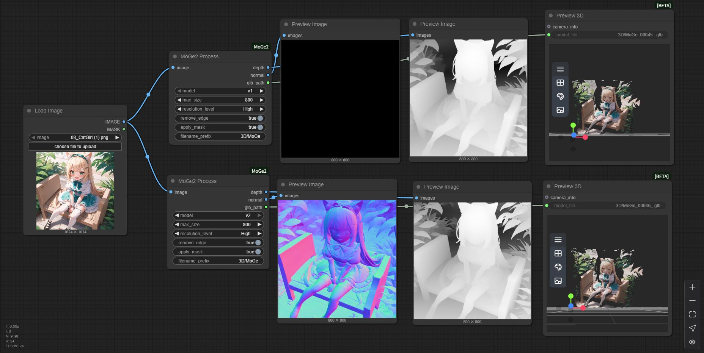

# Comfyui-MoGe2

what is this repo🤔? ask: [![zread](https://img.shields.io/badge/Ask_Zread-_.svg?style=plastic&color=00b0aa&labelColor=000000&logo=data%3Aimage%2Fsvg%2Bxml%3Bbase64%2CPHN2ZyB3aWR0aD0iMTYiIGhlaWdodD0iMTYiIHZpZXdCb3g9IjAgMCAxNiAxNiIgZmlsbD0ibm9uZSIgeG1sbnM9Imh0dHA6Ly93d3cudzMub3JnLzIwMDAvc3ZnIj4KPHBhdGggZD0iTTQuOTYxNTYgMS42MDAxSDIuMjQxNTZDMS44ODgxIDEuNjAwMSAxLjYwMTU2IDEuODg2NjQgMS42MDE1NiAyLjI0MDFWNC45NjAxQzEuNjAxNTYgNS4zMTM1NiAxLjg4ODEgNS42MDAxIDIuMjQxNTYgNS42MDAxSDQuOTYxNTZDNS4zMTUwMiA1LjYwMDEgNS42MDE1NiA1LjMxMzU2IDUuNjAxNTYgNC45NjAxVjIuMjQwMUM1LjYwMTU2IDEuODg2NjQgNS4zMTUwMiAxLjYwMDEgNC45NjE1NiAxLjYwMDFaIiBmaWxsPSIjZmZmIi8%2BCjxwYXRoIGQ9Ik00Ljk2MTU2IDEwLjM5OTlIMi4yNDE1NkMxLjg4ODEgMTAuMzk5OSAxLjYwMTU2IDEwLjY4NjQgMS42MDE1NiAxMS4wMzk5VjEzLjc1OTlDMS42MDE1NiAxNC4xMTM0IDEuODg4MSAxNC4zOTk5IDIuMjQxNTYgMTQuMzk5OUg0Ljk2MTU2QzUuMzE1MDIgMTQuMzk5OSA1LjYwMTU2IDE0LjExMzQgNS42MDE1NiAxMy43NTk5VjExLjAzOTlDNS42MDE1NiAxMC42ODY0IDUuMzE1MDIgMTAuMzk5OSA0Ljk2MTU2IDEwLjM5OTlaIiBmaWxsPSIjZmZmIi8%2BCjxwYXRoIGQ9Ik0xMy43NTg0IDEuNjAwMUgxMS4wMzg0QzEwLjY4NSAxLjYwMDEgMTAuMzk4NCAxLjg4NjY0IDEwLjM5ODQgMi4yNDAxVjQuOTYwMUMxMC4zOTg0IDUuMzEzNTYgMTAuNjg1IDUuNjAwMSAxMS4wMzg0IDUuNjAwMUgxMy43NTg0QzE0LjExMTkgNS42MDAxIDE0LjM5ODQgNS4zMTM1NiAxNC4zOTg0IDQuOTYwMVYyLjI0MDFDMTQuMzk4NCAxLjg4NjY0IDE0LjExMTkgMS42MDAxIDEzLjc1ODQgMS42MDAxWiIgZmlsbD0iI2ZmZiIvPgo8cGF0aCBkPSJNNCAxMkwxMiA0TDQgMTJaIiBmaWxsPSIjZmZmIi8%2BCjxwYXRoIGQ9Ik00IDEyTDEyIDQiIHN0cm9rZT0iI2ZmZiIgc3Ryb2tlLXdpZHRoPSIxLjUiIHN0cm9rZS1saW5lY2FwPSJyb3VuZCIvPgo8L3N2Zz4K&logoColor=ffffff)](https://zread.ai/zade23/ComfyUI-MoGe2) 

---

[ComfyUI](https://github.com/comfyanonymous/ComfyUI) nodes to use [MoGe2](https://github.com/microsoft/MoGe) prediction.

Original repo: https://github.com/microsoft/MoGe

Huggingface demo: https://huggingface.co/spaces/Ruicheng/MoGe-2

## Updates

- [2025-07-29]  Support `Ruicheng/moge-2-vitl-normal` and `Ruicheng/moge-vitl` model.

## Features

|version|model|3D|depth_map|normal_map|
|---|---|---|---|---|
|v1|[Ruicheng/moge-vitl](https://huggingface.co/Ruicheng/moge-vitl/tree/main)|✅|✅|❌|
|v2|[Ruicheng/moge-2-vitl-normal](https://huggingface.co/Ruicheng/moge-2-vitl-normal/tree/main)|✅|✅|✅|

> Using `v1` model to export `normal` will return black image instead of normal map. `Ruicheng/moge-vitl` does not support normal map.

## How to Use

### ComfyUI-Manager

Run ComfyUI → `Manager` → `Custom Nodes Manager` → search and install `Comfyui-MoGe2`

### Git Clone

1. Clone this repo to `ComfyUI/custom_nodes` 
2. Install requirements: `pip install -r requirements.txt`

## Model Support

- [x] [Ruicheng/moge-2-vitl-normal](https://huggingface.co/Ruicheng/moge-2-vitl-normal/tree/main)
- [x] [Ruicheng/moge-vitl](https://huggingface.co/Ruicheng/moge-vitl/tree/main)

## Acknowledgements

I would like to thank the contributors to the [MoGe](https://github.com/microsoft/MoGe), [ComfyUI-MoGe](https://github.com/kijia), for their open research.
